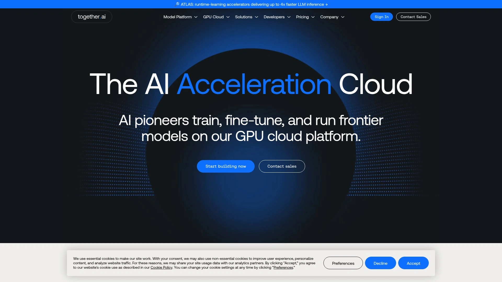

# Top 12 Best AI API Platforms in 2025 (Latest Updated)

Finding the right AI API platform can transform how you build intelligent applications. Whether you're integrating language models, generating images, or processing multimodal data, these platforms eliminate infrastructure complexity while delivering production-grade performance. From unified access to hundreds of models to lightning-fast inference speeds, today's AI API services offer developers unprecedented flexibility and cost control for deploying generative AI at scale.

---

## **[AIMLAPI](https://aimlapi.com)**

Your single gateway to 300+ cutting-edge AI models without juggling multiple providers.

AIMLAPI consolidates access to the latest language models, image generators, video creators, and speech processors through one unified API endpoint. Instead of managing separate integrations for GPT-4, Claude, Gemini, FLUX, and dozens of other models, developers can switch between them by simply changing a model parameter. The platform maintains 99% uptime with enterprise-grade security while handling automatic scaling during traffic spikes. With over 5,000 projects already deployed, AIMLAPI serves everything from chatbots and content generation to OCR and real-time AI search. The straightforward migration process requires minimal code changes, and the AI Playground lets you test models before committing. Round-the-clock support and transparent usage tracking through the dashboard make this ideal for teams building production applications that need reliable access to diverse AI capabilities without operational overhead.

---

## **[OpenRouter](https://openrouter.ai)**

Access 400+ AI models through one standardized API with intelligent routing.

OpenRouter provides a unified interface to hundreds of language models from OpenAI, Anthropic, Google, Meta, and open-source providers. The platform automatically routes requests to the optimal model based on your requirements, offering both free and paid options. Developers appreciate the OpenAI-compatible endpoints that make switching providers effortless, while the transparent pricing across different models helps control costs. The service supports streaming responses, function calling, and structured outputs for compatible models. With no infrastructure management required and pay-per-use billing, OpenRouter suits teams experimenting with multiple LLMs or building applications that need fallback options when primary models face rate limits.

***

## **[Replicate](https://replicate.com)**

Run thousands of open-source models with simple one-line deployment commands.

Replicate specializes in making open-source AI models instantly accessible through cloud APIs. The platform hosts everything from image diffusion models to language processors, with automatic scaling that handles traffic spikes and scales down to zero during idle periods. Developers can deploy custom models packaged with Cog, Replicate's containerization tool, or choose from thousands of community-contributed options. Hardware flexibility ranges from basic T4 GPUs to powerful H100 configurations, with per-second billing ensuring you only pay for actual compute time. The streaming API delivers real-time outputs for language models, while webhook support eliminates constant polling. Though cold starts can occur when scaling from zero, the straightforward API design and extensive model marketplace make Replicate excellent for prototyping and production workloads requiring diverse AI capabilities.

***

## **[Hugging Face Inference API](https://huggingface.co)**

Tap into the world's largest open-source AI model repository with serverless inference.

Hugging Face operates as the central hub for machine learning collaboration, hosting hundreds of thousands of models across every AI domain. The Inference API provides serverless access to popular models without deployment complexity, while the platform's extensive documentation and code examples accelerate integration. Developers benefit from free-tier access for experimentation, with scalable paid options for production workloads. The platform supports fine-tuning, collaborative model development, and custom deployments for specialized requirements. With strong community support and continuous model updates, Hugging Face serves teams prioritizing open-source solutions and collaborative AI development workflows.

***

## **[Together AI](https://together.ai)**

Deploy 200+ open-source models with serverless pay-per-token pricing and advanced fine-tuning.

Together AI focuses on making open-source models production-ready through optimized infrastructure. The platform provides instant access to popular models like Llama, Mixtral, Qwen, and specialized options for chat, images, code, and audio. Serverless deployment eliminates GPU management while automatic scaling handles varying workloads efficiently. Advanced fine-tuning capabilities include LoRA, reinforcement learning, and quantization-aware training for domain-specific customization. The OpenAI-compatible API simplifies migration, and opt-out privacy controls protect sensitive data. Together AI suits teams building with open-source models who need reliable performance, flexible customization options, and transparent per-token pricing without infrastructure overhead.

***

## **[Groq](https://groq.com)**

Experience breakthrough inference speeds with custom LPU architecture designed for language models.

Groq revolutionizes AI inference through purpose-built Language Processing Units that deliver speeds up to 4x faster than traditional GPU-based services. Independent benchmarks show Groq achieving 276 tokens per second for Llama 3.3 70B, making it the fastest provider for real-time applications. The platform offers free access to over half a million developers with five billion daily tokens available, while paid tiers provide predictable costs for production workloads. Groq supports leading open models including Llama variants, Mixtral, Gemma, and Whisper for speech recognition. The extreme throughput enables advanced techniques like chain-of-thought reasoning and autonomous agent systems where latency matters. While model selection focuses on proven open-source options rather than every available variant, the unmatched speed makes Groq essential for applications demanding instant responses.

***

## **[Fireworks AI](https://fireworks.ai)**

Optimize open-source models for maximum speed and scale on the fastest inference cloud.

Fireworks AI delivers high-throughput inference with industry-leading latency optimization. The platform hosts popular models like DeepSeek, LLaMA, Qwen, and DBRX while supporting multimodal tasks including text, speech, images, and embeddings. Advanced fine-tuning options encompass LoRA, reinforcement learning, and quantization-aware training for specialized use cases. Batch processing APIs offer 40% cost savings for bulk inference jobs, while on-demand GPUs including H100, H200, and AMD MI300X provide flexible deployment options with per-second billing. The optimized inference engine maintains consistent performance under heavy concurrent loads. SOC 2 Type II compliance, GDPR and HIPAA adherence, plus private deployment options address enterprise security requirements. Fireworks AI excels for teams requiring production-grade performance, advanced customization, and transparent pricing for generative AI applications.

***

## **[DeepInfra](https://deepinfra.com)**

Cost-effective inference for state-of-the-art models with straightforward OpenAI-compatible APIs.

DeepInfra packages cutting-edge AI models into simple REST APIs with competitive pricing. The platform supports major language models like Llama 3, Mixtral, and Qwen alongside embedding and image generation options. OpenAI-compatible endpoints work seamlessly with existing codebases, requiring only base URL and API key changes. The service handles scaling automatically while maintaining low latency for real-time applications. DeepInfra's straightforward pricing model charges per token without hidden fees, making cost planning predictable. The platform suits developers seeking reliable access to popular models without premium pricing, particularly for applications processing high volumes where cost efficiency matters alongside performance.

***

## **[Modal](https://modal.com)**

Deploy AI models with programmable infrastructure optimized for performance and elastic GPU scaling.

Modal provides a Python-centric serverless platform built specifically for AI workloads. The custom Rust-based container system delivers remarkably fast cold-start times, enabling applications to scale from hundreds of GPUs to zero in seconds. Developers define infrastructure requirements directly in Python code without writing YAML configurations or managing Docker complexity. The platform handles automatic resource allocation based on workload demands while billing only for actual usage. Modal excels for batch inference jobs, ML workflows, and compute-intensive tasks requiring dynamic scaling. Real-time monitoring prevents errors before they impact production. The straightforward two-file deployment process eliminates traditional infrastructure headaches, making Modal ideal for developers who want to focus on model development rather than cloud configuration management.

***

## **[Fal.ai](https://fal.ai)**

Generate images and videos with 600+ models achieving diffusion speeds 10x faster than standard.

Fal.ai specializes in generative media with optimized infrastructure for image and video creation. The platform hosts over 600 models with serverless inference that dramatically accelerates diffusion processes. Developers access state-of-the-art image generators, video synthesizers, and audio tools through straightforward APIs. The extreme performance optimization makes real-time generation viable for interactive applications. Fal.ai suits teams building content creation tools, marketing platforms, or creative applications where generation speed directly impacts user experience. The focus on generative media rather than general language models makes this platform purpose-built for visual and audio AI tasks requiring maximum throughput.

***

## **[Anthropic Claude API](https://anthropic.com)**

Build with safe, ethical AI reasoning optimized for complex coding and nuanced conversations.

Anthropic's Claude API prioritizes safety and reasoning depth for sophisticated AI applications. The models excel at intricate coding challenges, document analysis, and conversations requiring contextual understanding. Constitutional AI training methods reduce harmful outputs while maintaining helpful responses. Extended context windows handle large documents without summarization loss. The API supports function calling, streaming responses, and fine-grained control over model behavior. Anthropic's focus on AI safety research ensures continuous improvements in reliability and ethical performance. Claude suits applications where output quality, reasoning accuracy, and safety considerations outweigh raw speed, particularly for professional tools, research platforms, and enterprise applications handling sensitive information.

***

## **[Cohere](https://cohere.com)**

Customize natural language processing for generation, summarization, and multilingual support.

Cohere delivers enterprise-focused NLP capabilities through customizable models. The platform handles text generation, semantic search, summarization, and classification across multiple languages. Fine-tuning options let organizations adapt models to domain-specific terminology and use cases. The embed API creates high-quality vector representations for retrieval-augmented generation systems. Cohere's enterprise features include private deployments, dedicated support, and compliance certifications. The platform emphasizes production reliability with consistent latency and uptime guarantees. Cohere works well for businesses building internal AI tools, customer service automation, or knowledge management systems requiring customized language understanding beyond general-purpose models.

***

## FAQ

**How do I choose between different AI API platforms for my project?**

Consider your specific requirements: model variety, inference speed, cost structure, and customization needs. For maximum model selection, AIMLAPI or OpenRouter provide unified access to hundreds of options. When speed matters most, Groq delivers unmatched throughput. Budget-conscious projects benefit from platforms like DeepInfra or free tiers on Groq and Hugging Face. Teams needing fine-tuning should evaluate Together AI, Fireworks AI, or Cohere. Test critical models in playground environments before committing to ensure performance meets expectations.

**Can these platforms handle production-scale applications with high traffic?**

Yes, all listed platforms support production deployments with automatic scaling. Services like AIMLAPI, Replicate, and Together AI handle traffic spikes through serverless infrastructure that scales dynamically. Enterprise options from Fireworks AI, Anthropic, and Cohere provide SLA guarantees, dedicated support, and compliance certifications. Modal's elastic GPU scaling and Groq's architecture specifically address high-concurrency scenarios. Monitor usage patterns during initial deployment and leverage batch processing APIs when appropriate to optimize costs while maintaining performance.

**What's the typical integration process for switching to these AI APIs?**

Most platforms offer OpenAI-compatible endpoints requiring minimal code changes—simply update the base URL and API key while keeping existing request structures. Providers include SDKs for Python, Node.js, and other languages with comprehensive documentation and code samples. Migration typically takes hours rather than days for standard implementations. Playground environments let you test models before integration. Start with development keys on free tiers, validate performance against your use cases, then transition to production with appropriate rate limits and monitoring configured.

***

## Conclusion

The AI API landscape in 2025 offers unprecedented choice and performance for developers building intelligent applications. Whether you prioritize breadth of model access, extreme inference speeds, cost efficiency, or specialized capabilities, these platforms eliminate infrastructure complexity while delivering production-ready AI. For teams seeking comprehensive model coverage with minimal integration effort, **[AIMLAPI](https://aimlapi.com)** stands out by consolidating 300+ models into one reliable endpoint, perfect for applications requiring flexibility to experiment with different AI capabilities without managing multiple provider relationships.
